# `test_plan.md`

## 1. Sign Up Test Cases

| Case | Input | Expected Result | Actual Result | Status | Screenshot |
| :--- | :--- | :--- | :--- | :--- | :--- |
| **Invalid** | `Name: V`, `Email: user@ gmail.com` | Tooltip error message: "A part following '@' should not contain the symbol ' '". | A tooltip error message is shown. | Passed | 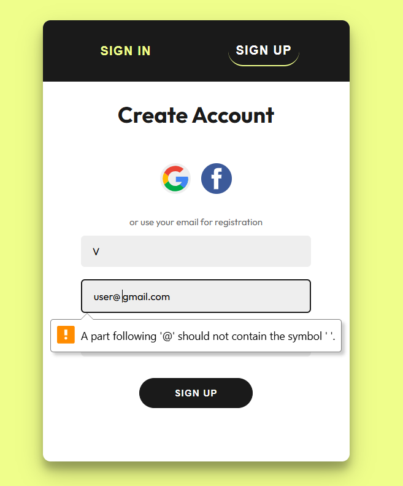 |
| **Valid** | `Name: Vi`, `Email: user@gmail.com` | Account created successfully. | A "Login successful" message is shown. | Passed |  |

---

## 2. Sign In Test Cases

| Case | Input | Expected Result | Actual Result | Status | Screenshot |
| :--- | :--- | :--- | :--- | :--- | :--- |
| **Invalid** | `Email: gautam.thota@example.com`, `Password: dlufgsiudfi` | Error message: "Invalid email or password". | A red banner with the text "Invalid email or password" is displayed. | Passed | 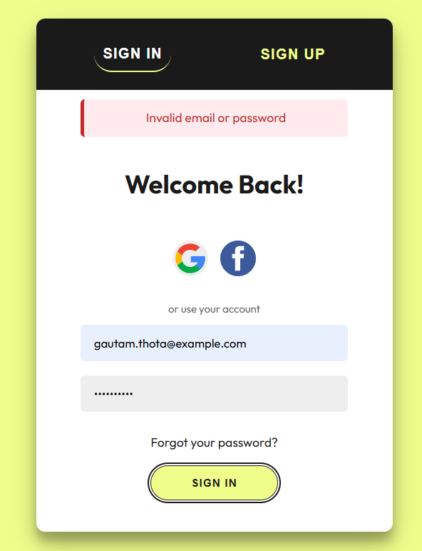 |
| **Valid** | `Email: gautam.thota@example.com`, `Password: 123456` | User successfully authenticated. | A green banner with "Login successful" is displayed. | Passed | 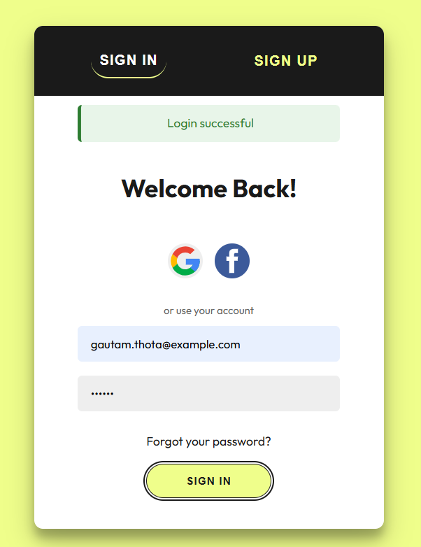 |

---

## 3. Profile Update Test Cases

| Case | Input | Expected Result | Actual Result | Status | Screenshot |
| :--- | :--- | :--- | :--- | :--- | :--- |
| **Invalid** | `Phone: 2355` | Alert message: "Please enter a valid 10-digit Indian phone number starting with 9, 8, 7, or 6." | A JavaScript alert appears. | Passed |  |
| **Valid** | `Phone: 7869408765` | Profile updated successfully. | A JavaScript alert appears saying: "Profile updated successfully!". | Passed | 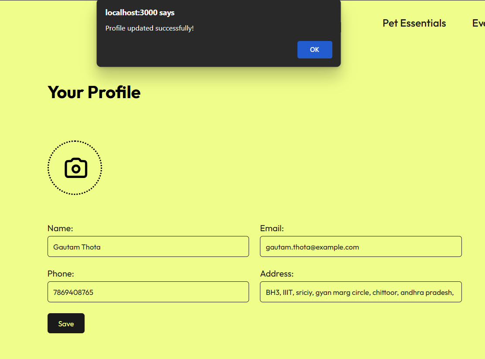 |

---

## 4. Payment Test Cases

| Case | Input | Expected Result | Actual Result | Status | Screenshot |
| :--- | :--- | :--- | :--- | :--- | :--- |
| **Invalid** | `Expiry: 23/34` | Alert message: "Invalid month. Please enter a value between 01 and 12." | A JavaScript alert appears. | Passed |  |
| **Valid** | `Expiry: 12/34` | The form passes validation. | The form submits successfully. | Passed |  |

---

## 5. Sign Up Test Cases for Shopmanager

| Case | Input | Expected Result | Actual Result | Status | Screenshot |
| :--- | :--- | :--- | :--- | :--- | :--- |
| **Invalid** | `Name: Jeevan`, `Email: jeevankumar.vendor@gmail.com`, `Contact Number:9456521365`,`password:12345678`,`confirm password:12345678`,`Store name:Wholesale`,`Store Location:Warangal` | error message: "Please enter a valid 10-digit phone number and Please enter a valid Gmail address(e.g.,example@gmail.com)". | A error message is shown. | Passed | 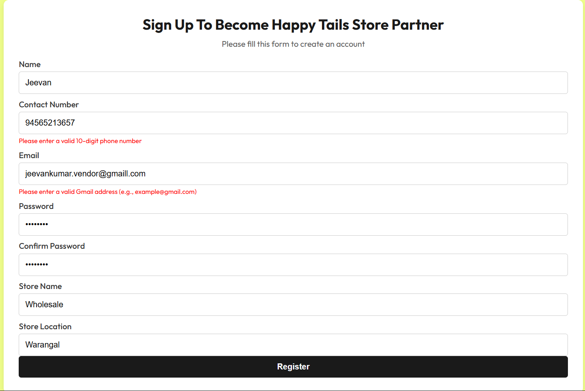 |
| **Valid** | `Name: Jeevan`, `Email: jeevankumar.vendor@gmaill.com`, `Contact Number:94565213657`,`password:12345678`,`confirm password:12345678`,`Store name:Wholesale`,`Store Location:Warangal` | Account created successfully. | A "Login successful" message is shown. | Passed | 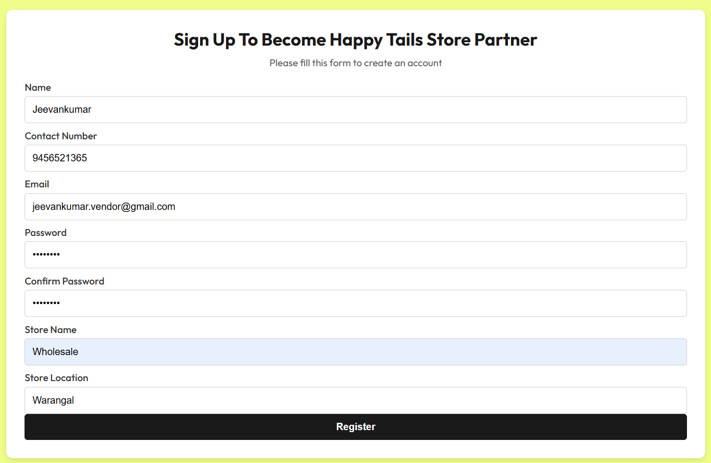 |

---

## 6. Sign In Test Cases for Shopmanager

| Case | Input | Expected Result | Actual Result | Status | Screenshot |
| :--- | :--- | :--- | :--- | :--- | :--- |
| **Invalid** | `Email: veda.prakash.vendor@gmaqil.com`, `Password: 12345678`,`Role : Store Manager`| Error message: "Invalid email or password". | A red banner with the text "Invalid email or password" is displayed. | Passed | 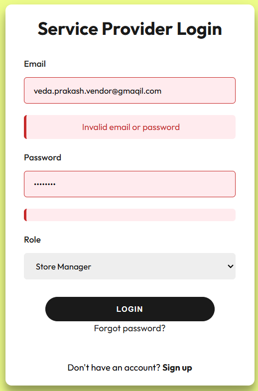 |
| **Valid** | `Email: veda.prakash.vendor@gmail.com`, `Password: 12345678`,`Role : Store Manager`| User successfully authenticated. | A green banner with "Login successful" is displayed. | Passed |  |

---

## 7. Profile Update Test Cases for Shopmanager

| Case | Input | Expected Result | Actual Result | Status | Screenshot |
| :--- | :--- | :--- | :--- | :--- | :--- |
| **Invalid** | `Email: veda.prakasah.vendor@gmaail.com` | Alert message: "Please use a Valid email from  a valid provider" | A JavaScript alert appears. | Passed | 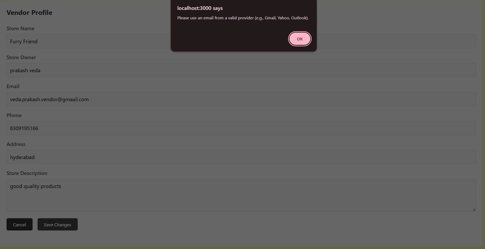 |
| **Valid** | `Email: veda.prakasah.vendor@gmail.com` | Profile updated successfully. | A JavaScript alert appears saying: "Profile updated successfully!". | Passed | 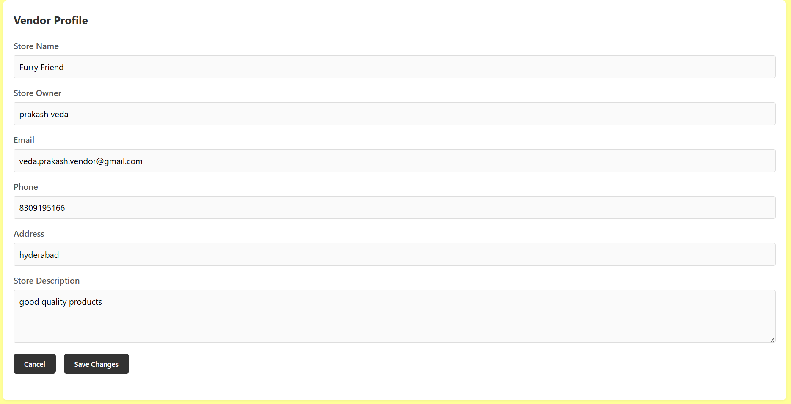 |

---

## 8. Add New product Test Cases

| Case | Input | Expected Result | Actual Result | Status | Screenshot |
| :--- | :--- | :--- | :--- | :--- | :--- |
| **Invalid** | `Productname:Pet Scraching Poll`,`Category:Toys`,`Pet Type:Cat`,`Stock Satus:In Stock`,`Description:New Stock`,`Size:medium`,`Regular Price:400`,`Sale price:500`,`Stock Quantity:15` | error message: "Sale price must be less than regular price" | A error message is shown | Passed | 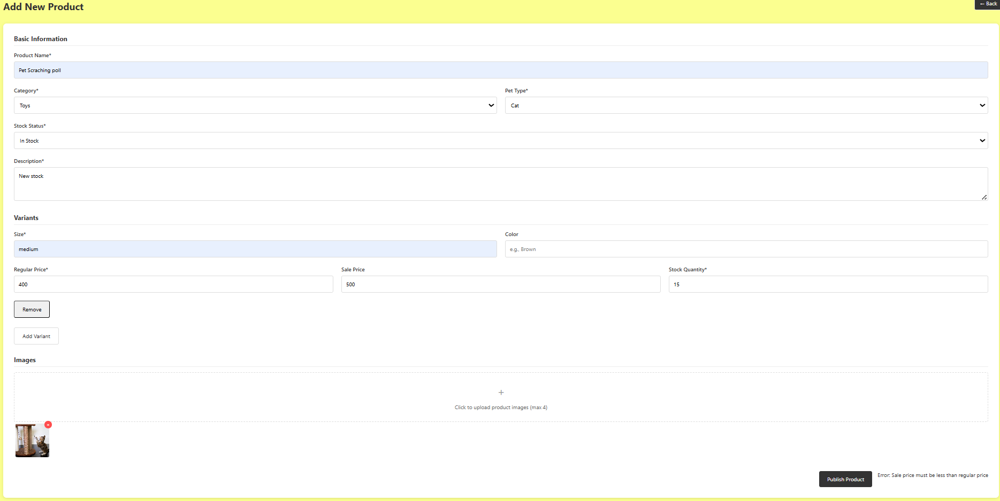 |
| **Valid** |  `Productname:Pet Scraching Poll`,`Category:Toys`,`Pet Type:Cat`,`Stock Satus:In Stock`,`Description:New Stock`,`Size:medium`,`Regular Price:400`,`Sale price:350`,`Stock Quantity:15` | Product should be added | Product added successfully. | Passed | 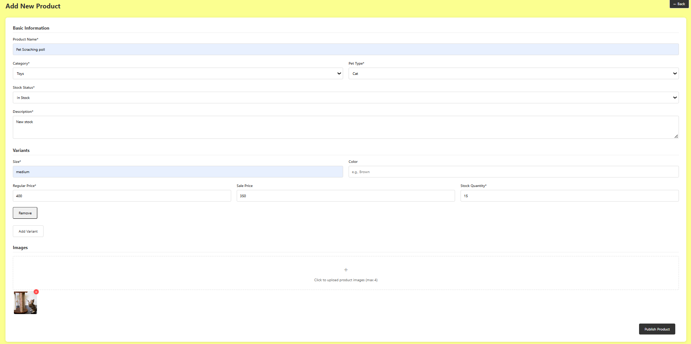 |

---