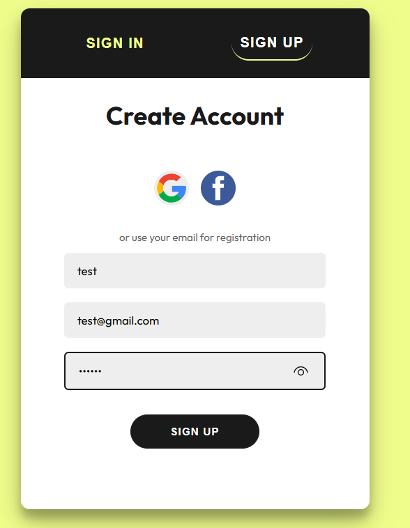
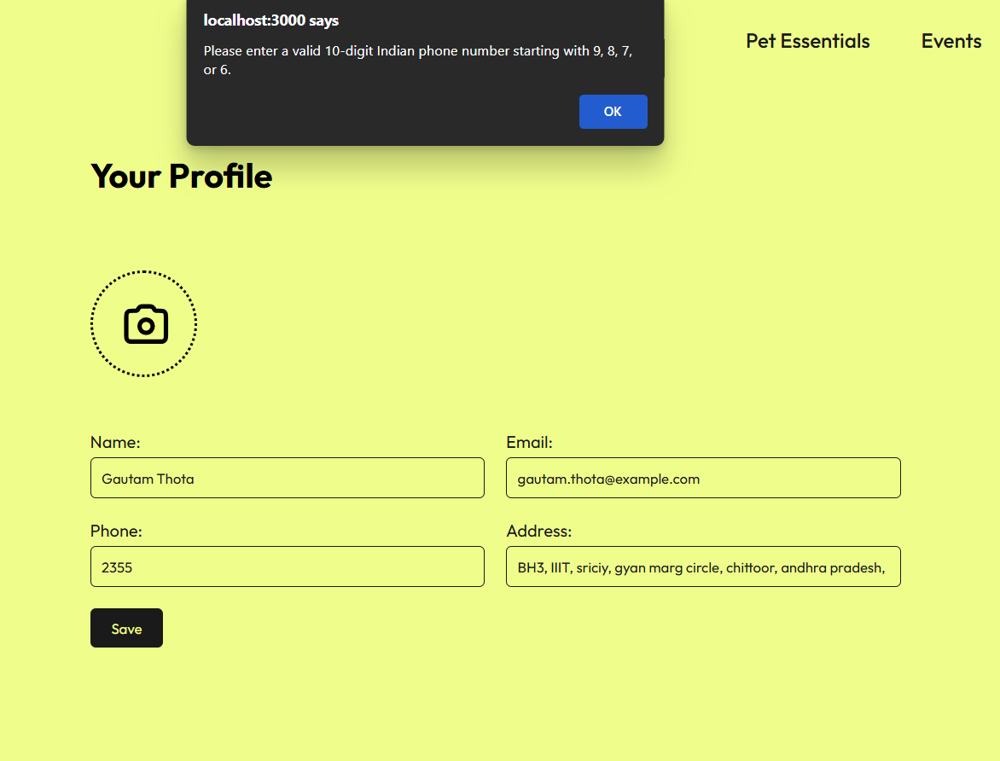
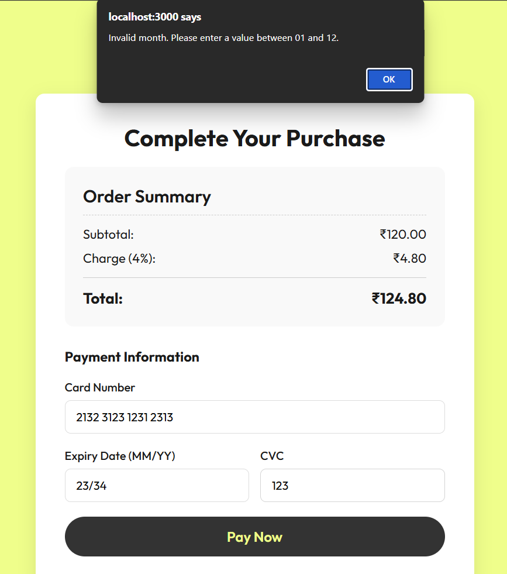
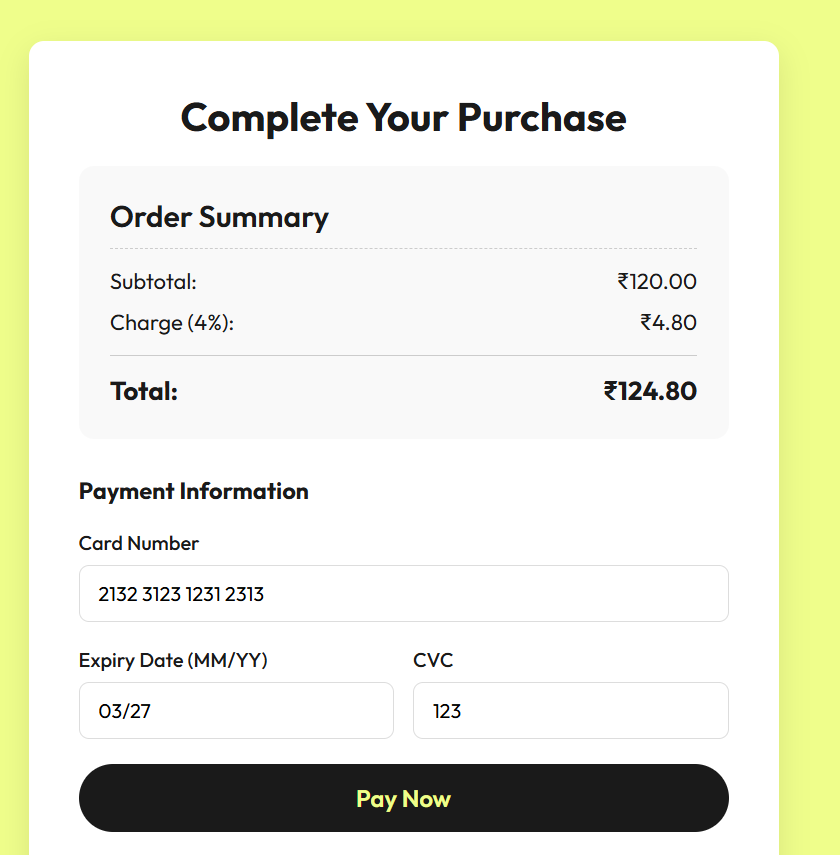

# `test_plan.md`

## 1. Sign Up Test Cases

| Case | Input | Expected Result | Actual Result | Status | Screenshot |
| :--- | :--- | :--- | :--- | :--- | :--- |
| **Invalid** | `Name: V`, `Email: user@ gmail.com` | Tooltip error message: "A part following '@' should not contain the symbol ' '". | A tooltip error message is shown. | Passed |  |
| **Valid** | `Name: Vi`, `Email: user@gmail.com` | Account created successfully. | A "Login successful" message is shown. | Passed |  |

---

## 2. Sign In Test Cases

| Case | Input | Expected Result | Actual Result | Status | Screenshot |
| :--- | :--- | :--- | :--- | :--- | :--- |
| **Invalid** | `Email: gautam.thota@example.com`, `Password: dlufgsiudfi` | Error message: "Invalid email or password". | A red banner with the text "Invalid email or password" is displayed. | Passed |  |
| **Valid** | `Email: gautam.thota@example.com`, `Password: 123456` | User successfully authenticated. | A green banner with "Login successful" is displayed. | Passed |  |

---

## 3. Profile Update Test Cases

| Case | Input | Expected Result | Actual Result | Status | Screenshot |
| :--- | :--- | :--- | :--- | :--- | :--- |
| **Invalid** | `Phone: 2355` | Alert message: "Please enter a valid 10-digit Indian phone number starting with 9, 8, 7, or 6." | A JavaScript alert appears. | Passed |  |
| **Valid** | `Phone: 7869408765` | Profile updated successfully. | A JavaScript alert appears saying: "Profile updated successfully!". | Passed |  |

---

## 4. Payment Test Cases

| Case | Input | Expected Result | Actual Result | Status | Screenshot |
| :--- | :--- | :--- | :--- | :--- | :--- |
| **Invalid** | `Expiry: 23/34` | Alert message: "Invalid month. Please enter a value between 01 and 12." | A JavaScript alert appears. | Passed |  |
| **Valid** | `Expiry: 12/34` | The form passes validation. | The form submits successfully. | Passed |  |